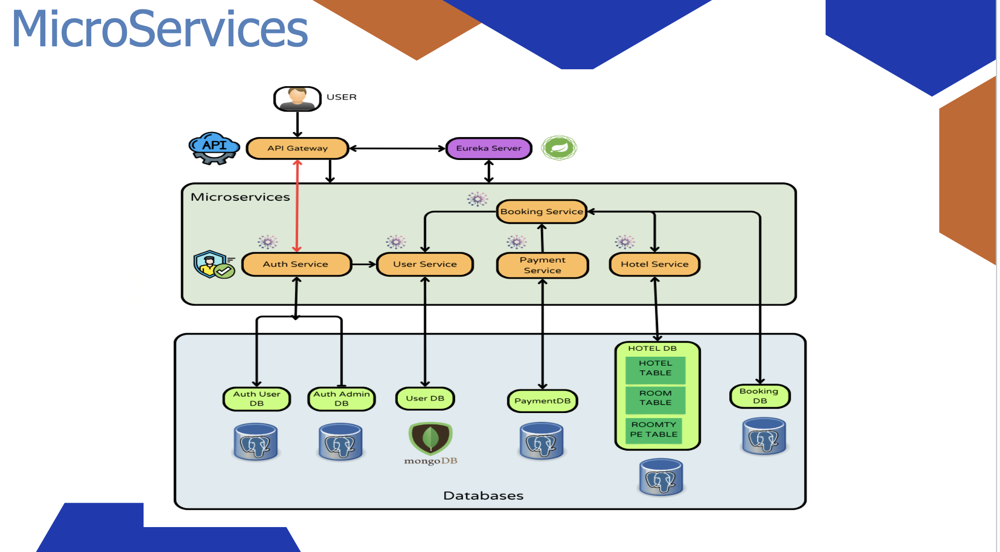
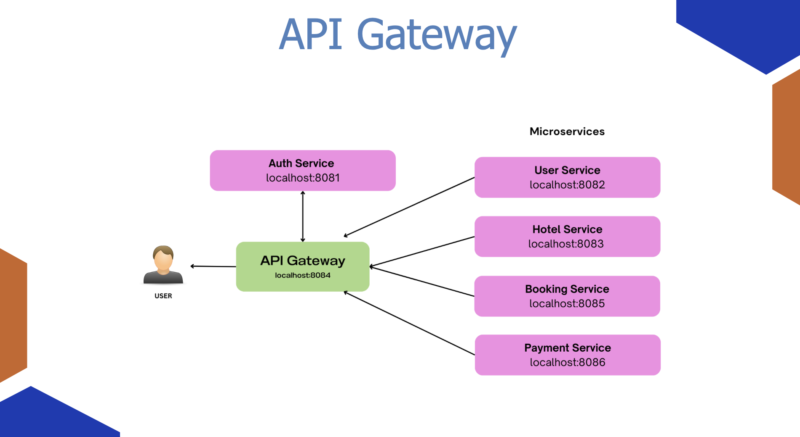
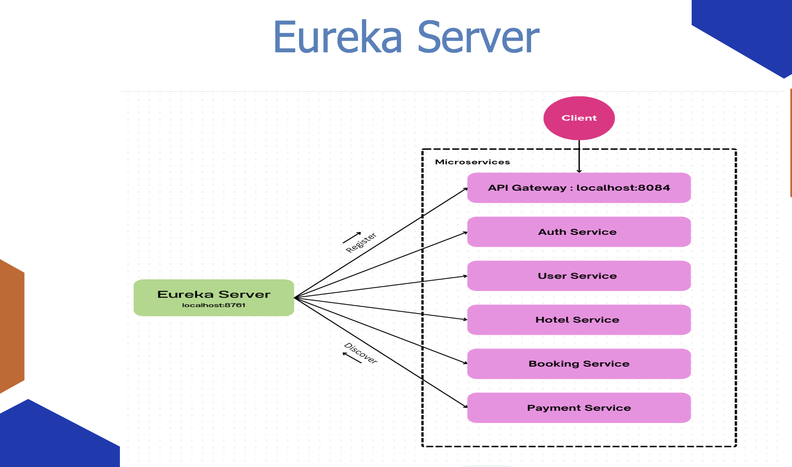
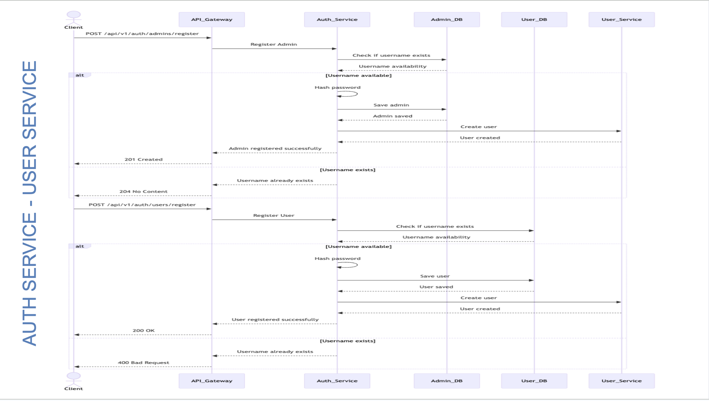
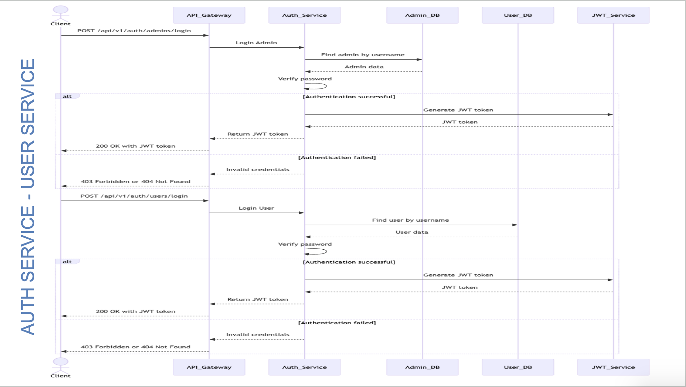
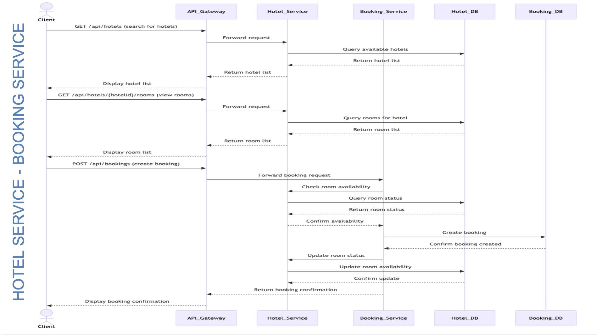
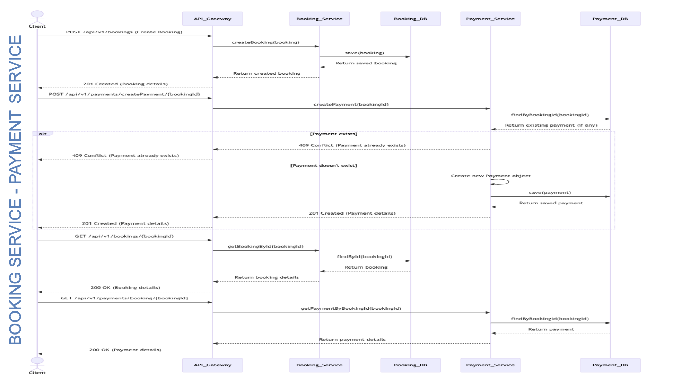

# Stop-N-Rest

This is Our Capstone Project For the FYNDNA-Training-Program

## Microservices-Architecture

## Api-Gateway-Congiguration

## Eureka-Server-Configuration

# Sequence-Diagrams

## Auth <<--->> User

## Auth <<--->> User

## Hotel <<--->> Booking

## Booking <<--->> Payments

# Swagger-Configuration
Link : http://localhost:8084/swagger-ui.html
